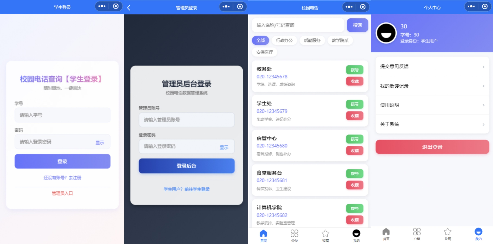

校园常用电话查询小程序

基于 UniApp + Vue.js 开发的一站式校园通讯录解决方案，解决校园各处室电话零散、紧急查询不便的痛点。

技术栈

核心框架：UniApp + Vue.js
开发工具：HBuilder X、微信开发者工具
开发模式：微信小程序原生 + H5 混合开发

功能模块

用户端：学号登录/注册、分类展示、关键字检索、一键拨号、电话收藏、意见反馈。
管理端：独立身份鉴权、通讯录数据动态维护与更新。

架构说明

目前数据层采用本地 Mock 数据实现前端闭环，若需连接后端数据库则需要克隆至本地后自行配置。
已预留标准 RESTful API 接口，计划接入微信云开发或 Java 后端服务器。

项目预览
克隆至本地后，使用 HBuilder X 运行至微信开发者工具进行预览。

## 项目预览
